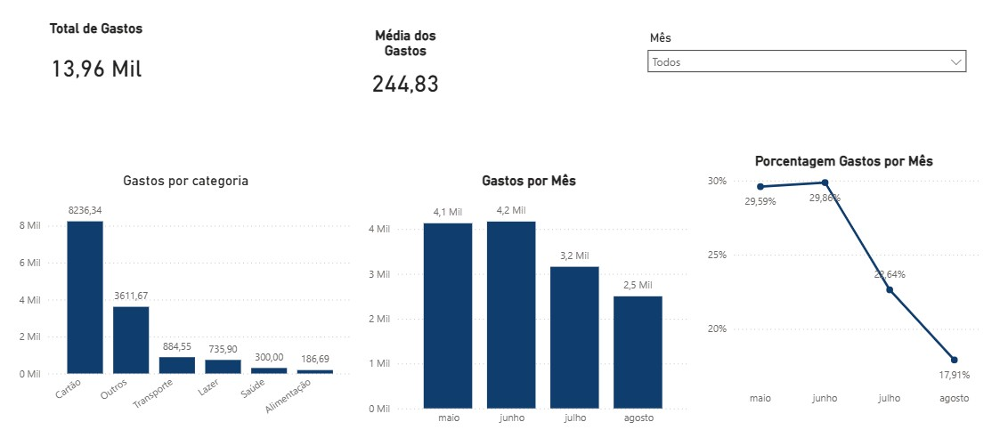

# Sistema de Análise Financeira Pessoal com Pipeline Automatizado


> ⚡ **Este é um sistema em operação** — não uma análise estática. Novos dados são processados mensalmente e os insights evoluem com o comportamento financeiro real.

---

## 🎯 Problema de Negócio

Controle financeiro pessoal feito manualmente em planilhas gera inconsistência, dificulta análise histórica e não oferece visibilidade real sobre padrões de consumo ao longo do tempo.

Este projeto cria um **pipeline automatizado de ponta a ponta** que ingere dados do Google Sheets, trata e categoriza transações automaticamente por palavras-chave, persiste em banco relacional SQLite e gera um dashboard interativo no Power BI — transformando um controle manual em um processo orientado por dados.

> **Pergunta central:** Onde vai o meu dinheiro? Quais categorias concentram mais gastos e como meu comportamento financeiro evolui mês a mês?

---

## 🔍 Principais Achados

> Base atual: **57 transações · 4 meses (mai–ago 2024) · Total monitorado: R$ 13.955**

| # | Achado | O que isso significa |
|---|---|---|
| 1 | **Cartão de crédito** representa **59%** dos gastos (R$ 8.236) | A fatura do cartão consolida dezenas de compras — separar os itens da fatura é a próxima evolução que tornaria a análise 10x mais granular |
| 2 | **"Outros"** ainda concentra **25,8%** dos gastos (R$ 3.597) | 1 em cada 4 reais gastos ainda sem classificação — cada nova palavra-chave no dicionário de categorias reduz diretamente esse número |
| 3 | **Junho foi o mês de maior gasto** (R$ 4.167) — 66% acima de agosto (R$ 2.500) | Oscilação de R$ 1.667 entre meses indica ausência de orçamento por categoria — dado que o sistema agora rastreia automaticamente |

---

## ⭐ Diferenciais Técnicos deste Projeto

| Diferencial | Por que importa |
|---|---|
| **Sistema vivo com dados reais** | Não é um case fictício — é um pipeline em operação com dados pessoais reais atualizados mensalmente |
| **Engine de categorização extensível** | Baseada em dicionário de palavras-chave: adicionar uma nova categoria não exige alterar a lógica do código |
| **Pipeline ponta a ponta** | Google Sheets → Python → SQLite → Power BI — simula uma stack de dados corporativa real |
| **Iniciativa própria** | Projeto criado por necessidade real, não por demanda de curso ou processo seletivo |

---

## ⚙️ Como o Pipeline Funciona

```
Google Sheets → CSV → Python (tratamento + categorização) → SQLite → consultas SQL → Power BI
```

| Etapa | O que acontece |
|---|---|
| **1. Ingestão** | Dados exportados do Google Sheets em CSV |
| **2. Tratamento** | Padronização de colunas, conversão monetária (R$ → float), conversão de datas |
| **3. Categorização automática** | Engine baseada em dicionário extensível de palavras-chave |
| **4. Persistência** | Dados persistidos em banco SQLite para consultas analíticas |
| **5. Análise SQL** | Total, por categoria, evolução mensal, ticket médio e percentual por categoria |
| **6. Exportação** | Base tratada exportada em CSV para integração com Power BI |
| **7. Visualização** | Dashboard interativo com KPIs financeiros atualizado a cada execução |

---

## 💡 Impacto Esperado

Com o pipeline operacional, é possível:

- **Identificar padrões de consumo** por categoria ao longo dos meses
- **Detectar meses atípicos** de gasto comparando com a média histórica
- **Reduzir a categoria "Outros"** continuamente à medida que o dicionário de categorias evolui
- **Refinar o orçamento pessoal** com base em dados históricos reais, não em estimativas
- **Expandir para receitas e investimentos** — consolidando visão patrimonial completa

---

## 📊 Dashboard

<p align="center">
  
</p>

- **Gastos por categoria:** distribuição percentual e absoluta das despesas no período
- **Evolução financeira mensal:** comparativo mês a mês do total gasto — detecta sazonalidade e picos
- **Ticket médio mensal:** valor médio por transação, útil para identificar mudanças de comportamento
- **Distribuição percentual:** fatias de consumo por categoria para embasar decisões de corte

---

## 📂 Estrutura do Projeto

```
Analise_Financeira_Pessoal/
├── data/
│   ├── raw/                       # Dados brutos (não versionados por privacidade)
│   │   └── financas_2026.csv
│   └── processed/                 # Gerado automaticamente pelo pipeline
│       └── dados_tratados.csv
├── database/
│   └── financas.db                # Banco SQLite gerado pelo pipeline
├── dashboard/
│   ├── visual_finances.jpg        # Imagem exportada do dashboard
│   └── Dashboard_gastos.pbix      # Arquivo Power BI
├── src/
│   └── main.py                    # Pipeline completo
├── requirements.txt
└── README.md
```

---

## 🚀 Como Reproduzir

```bash
# 1. Clone o repositório
git clone https://github.com/Luizcomzz/Analise_Financeira_Pessoal.git
cd Analise_Financeira_Pessoal

# 2. Crie e ative o ambiente virtual
python -m venv venv
venv\Scripts\activate        # Windows
# source venv/bin/activate   # Mac/Linux

# 3. Instale as dependências
pip install -r requirements.txt

# 4. Adicione seu CSV de transações em:
#    data/raw/financas_2026.csv
#    (use a planilha modelo do Google Sheets como base)

# 5. Execute o pipeline
python src/main.py
```

> **Planilha modelo:** disponível no [Google Sheets](https://docs.google.com/spreadsheets/d/1YnmxyQ9UEySS7x8o_XhC5K4v2xB2Np2OQDJj7tapOdI/edit?usp=sharing). Para exportação automática em CSV, utilize o Google Apps Script integrado à planilha.

---

## 📈 KPIs Monitorados (mai–ago 2024)

| Indicador | Resultado |
|---|---|
| Total de transações analisadas | 57 |
| Período coberto | 4 meses |
| Total monitorado | R$ 13.955 |
| Mês de maior gasto | Junho / R$ 4.167 |
| Mês de menor gasto | Agosto / R$ 2.500 |
| Maior categoria | Cartão (59% · R$ 8.236) |
| Categoria a refinar | Outros (25,8% · R$ 3.597) |

---

## 🗺️ Evoluções Planejadas

### Curto prazo
- Expandir o dicionário de categorias para reduzir "Outros" abaixo de 10%
- Separar itens da fatura do cartão por categoria real de gasto

### Médio prazo
- Incluir tabela de receitas para cálculo automático de saldo mensal
- Separar gastos fixos de variáveis para análise de margem disponível

### Longo prazo
- Modelagem integrada de gastos, receitas e investimentos
- Automação completa da ingestão via Google Apps Script
- Consolidação patrimonial com visão de evolução de patrimônio líquido

---

## 🛠️ Tecnologias Utilizadas

| Ferramenta | Finalidade |
|---|---|
| [Python 3.14](https://www.python.org/) | Linguagem de programação principal |
| [Pandas](https://pandas.pydata.org/) | Tratamento e transformação dos dados |
| [SQLite](https://sqlite.org/) | Persistência e consultas analíticas |
| [Power BI](https://www.microsoft.com/pt-br/power-platform/products/power-bi/desktop) | Dashboard interativo de KPIs financeiros |
| [Google Sheets](https://workspace.google.com/products/sheets/) | Fonte de dados com exportação via Apps Script |

---

## 👤 Autor

Desenvolvido por **Luiz** · [LinkedIn](https://linkedin.com/in/seu-perfil) · [GitHub](https://github.com/Luizcomzz)